  

    
  <b> .- the inexpensive dual-SID/FM replacement that you can build yourself -. </b>  

The SIDKick pico ("SKpico") is a drop-in replacement for the SID 6581/8580 sound chips in the Commodore 64 and 128 computers, and it can also emulate the SFX Sound Expander (FM). 
It has been designed as an inexpensive alternative to other replacements while not making compromises regarding quality. 
It consists of a simple interface board and a Raspberry Pi Pico (or compatible clone).
The emulation is based on an extended version of reSID 0.16 (with parts from reSID 1.0), and also includes a few additional features:

-	dual 6581 and/or 8580 emulation based on reSID (optional: extension for digi-playing techniques), or 6581/8580 plus FM emulation
-	2nd-SID address at $d400, $d420, $d500, $d420 + $d500 simultaneously, $de00, $df00 (on C128 no $d500), or any address when an external chip select signal is used (e.g. on Ultimate 64 boards)
-	paddle/mouse support
-	built-in configuration menu (launch with "SYS 54301"/"SYS 54333", also from C128-mode)
- built-in PRG launcher ("SYS 54333,0" etc. or from the menu)
- two hardware variants with sound output via ...
    - PWM (mono) through the C64/C128 mainboard and/or in stereo via a PCM5102A-DAC-board, or
    - onboard-DAC through the C64/C128 mainboard and/or line-out

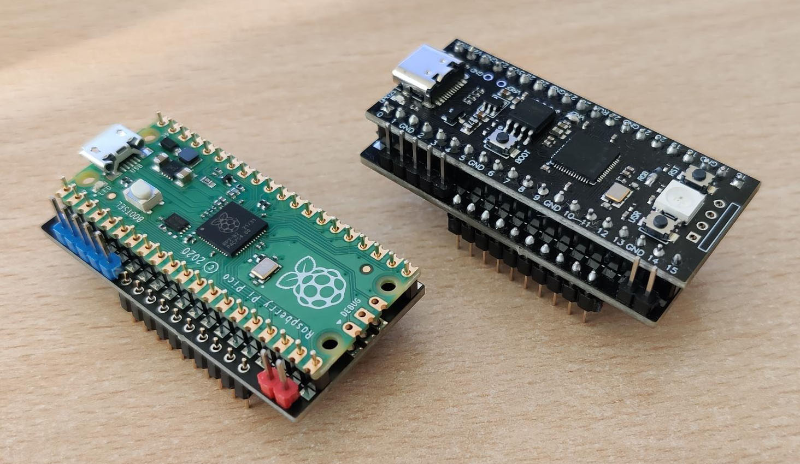
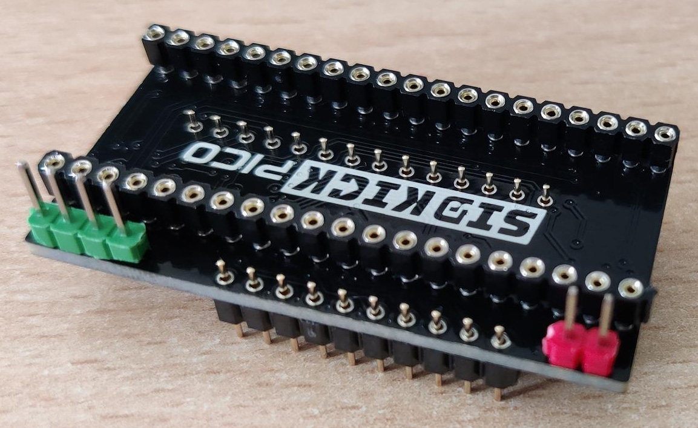

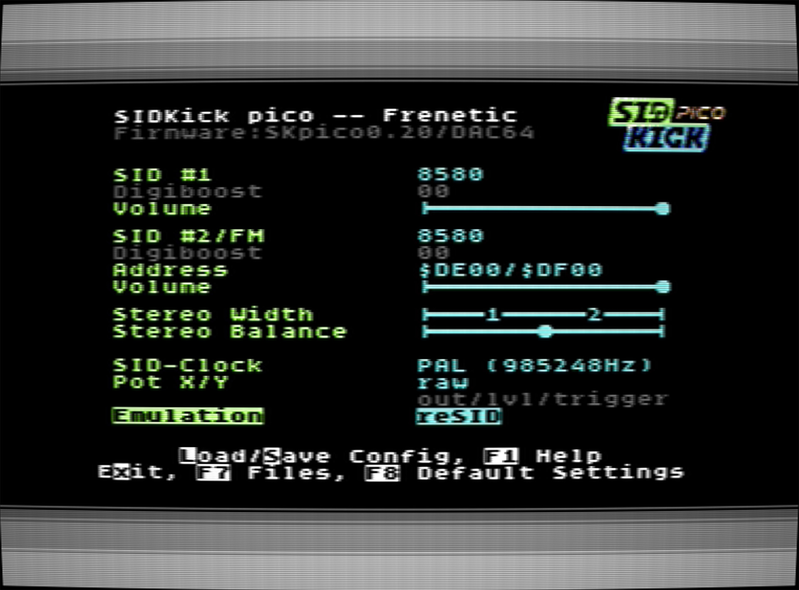  

 

You can listen to the SIDKick pico in two videos by emulaThor:  

<a href="http://www.youtube.com/watch?v=3Wam-UXWBd0">
<a href="http://www.youtube.com/watch?v=aWAfkrH59jg">

 

## How to build a SIDKick pico

This section summarizes building and setting up the hardware. 

### PCB ordering

You can order the PCBs from PCBWay without or with SMD-parts preassembled: [SKpico with PWM or external DAC](https://www.pcbway.com/project/shareproject/W160781ASB18_Gerber_1790f9c8.html) and [SKpico with onboard-DAC](https://www.pcbway.com/project/shareproject/SIDKick_pico_0_2_DAC_SID_6581_8580_replacement_for_C64_C128_01088623.html).

You can also find my [other projects](https://www.pcbway.com/project/member/?bmbno=B5CDD8BE-199B-47) there. In case you don't have an account at PCBWay yet: [register via this link](https://pcbway.com/g/x1UjP0) and get "$5 of New User Free Credit".

Even simpler, you can obtain pre-assembled SKpicos from
- [Restore Store](https://restore-store.de) (DE/EU)
- [Retro8BITshop](https://retro8bitshop.com) (NL/EU)
- [AmericanRetro.shop](https://americanretro.shop) (US)
- [Plan-Net CSS](https://plannetcss.com) (CA)

Please do not buy from those who knowingly violate the license and sell overpriced SKpicos out of greed (see [Hall of Shame](#license-hall-of-shame)).

### Building / Soldering

The first step when building the SKpico is soldering the surface-mount components. These are located on the **bottom side** of the PCB. 
Please see the BOM and assembly information [SKpico with PWM or external DAC rev 0.1 (old)](https://htmlpreview.github.io/?https://github.com/frntc/SIDKick-pico/blob/master/BOM/ibom.html), [SKpico with PWM or external DAC rev 0.2](https://htmlpreview.github.io/?https://github.com/frntc/SIDKick-pico/blob/master/BOM/ibom_rev2.html) and [SKpico with onboard-DAC rev 0.2](https://htmlpreview.github.io/?https://github.com/frntc/SIDKick-pico/blob/master/BOM/ibom_rev2_dac.html). Note that the BOM for the onboard-DAC version shows a LM358 OpAmp (which works perfectly fine) -- for the more audiophile tinkerers I suggest using a TL072 (the PCBWay project uses the TL072!).

The next step is to solder the pin header and sockets  which works best if you follow these steps:
- solder the SID-socket pin header **with 14 pins** in the middle of the PCB
- solder a socket for the Pico or the Pico directly (in case you solder directly with castellated edges: make sure to cut the pin tips and put insulation tape on them!)
- solder the SID-socket pin header close to the edge of the PCB. It has only **10 pins**, the connector Vcc-GND-CK-DIN-BCK is for the external DAC, GND-L-GND-R is the audio line-out (depending on the PCB-variant).
- no pins are required for the 3 connections at the center-bottom of the PCB (they only exist on the non-DAC PCB)!
- optional: solder the pin headers for the DAC (blue), DAC-output (green), and additional address/signal lines (red)
 

   
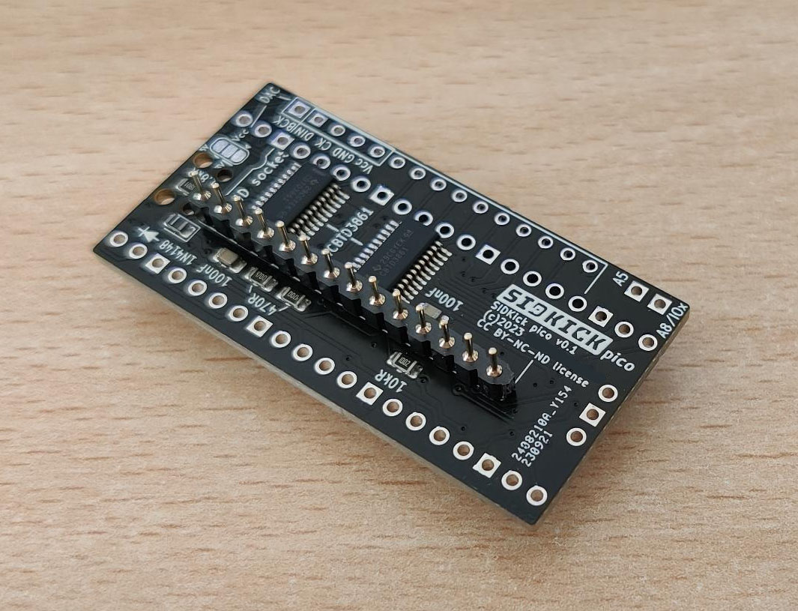   
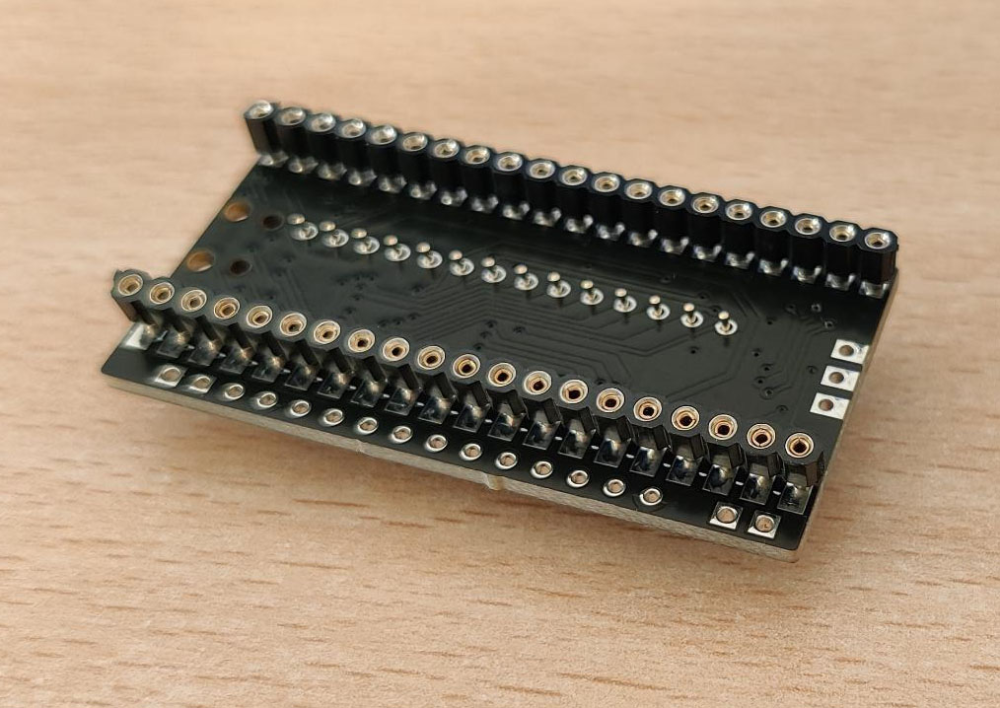   
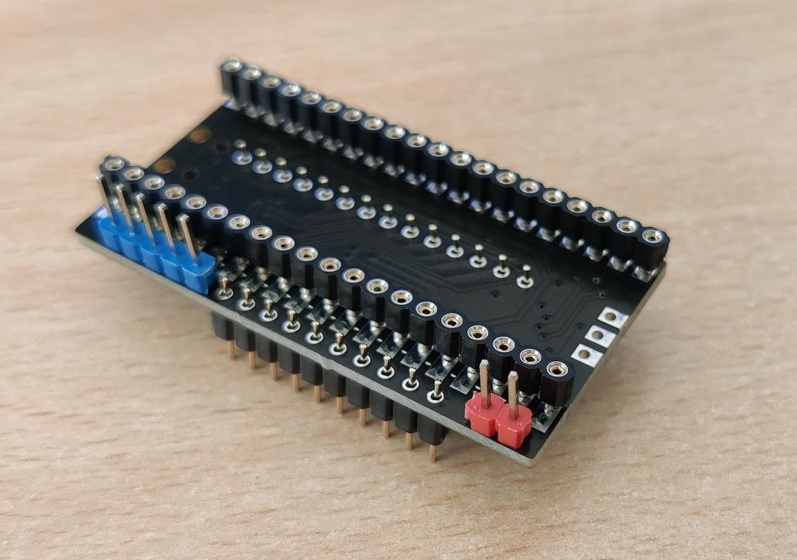   

 

## Installing a SIDKick pico

Pay attention to *correctly orient and insert* the RPi Pico and the SKpico (see backside of PCB for markings) into the SID-socket of your C64 or C128. Note that in a C128D you might need to remove one support bolt of the power supply to fit the SKpico. 

You can choose to emulate a single SID only. If you want to use a second SID or FM sound you need to connect additional cables to get the signals to the SKpico as they are not available at the SID socket:

### Installing additional cables in C64
| SKpico pin  | C64 (see images for alternative locations) |
|----------|:-------------|
| A5/A6 | CPU Pin 12 (for $d420) or 13 (required for FM) | 
| A8/IO | CPU Pin 15 (required for $d500)   OR expansion port pin 7 or 10 for $de00/$df00 addresses   OR external chip select-signal  (FM requires $df00) |

### Installing additional cables in C128
| SKpico pin  | C128 |
|----------|:-------------|
| A5/A6 |  CPU Pin 12 (for $d420) or 13 (required for FM) | 
| A8/IO |  $d500 is not supported for the C128   connect to expansion port pin 7 or 10 for $de00/$df00   OR external chip select-signal  (FM requires $df00) |

The photographs show various (other) locations where these signals can be tapped, e.g. A5 to A8 and IOx are conveniently available on some mainboards (see photo of ASSY 250469), A5/A6/A8 at the ROM-chips (not shown on the photos: on the 250469 at the kernal ROM 251913 at pin 5, 4, and 29, for example).

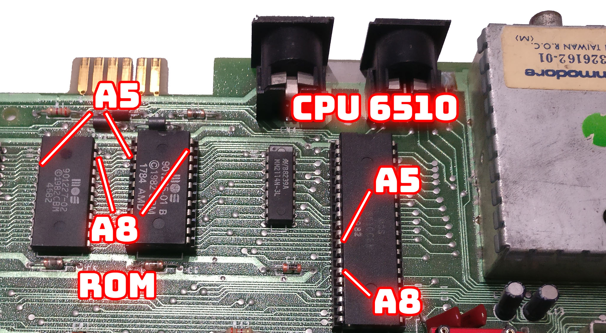 
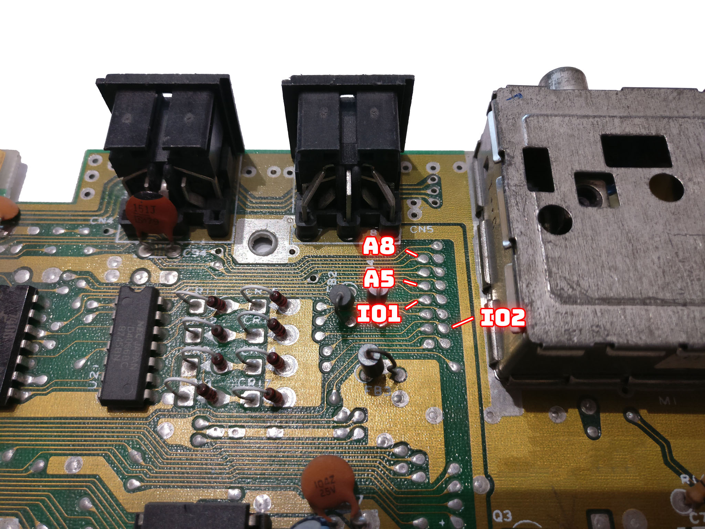  
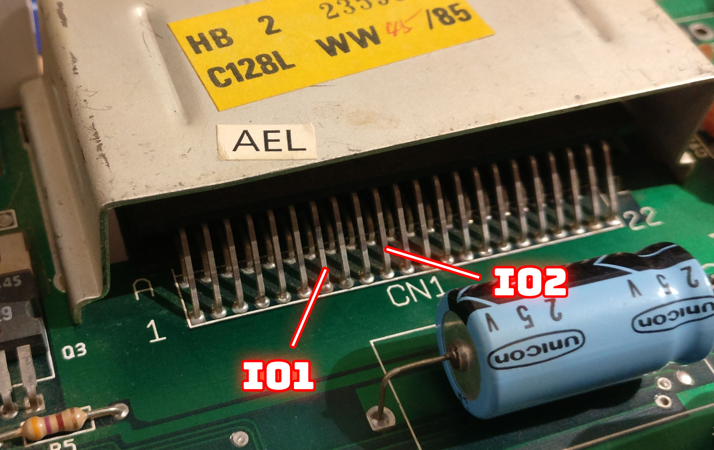  

The built-in configuration tool autodetects and displays which cables have been (properly) installed and shows only possible SID-addresses. 

**Hint:** before attaching/detaching signal cables, set the 2nd-SID/FM address to $d400 in the config tool.

 

### Audio Output

#### PCB without DAC

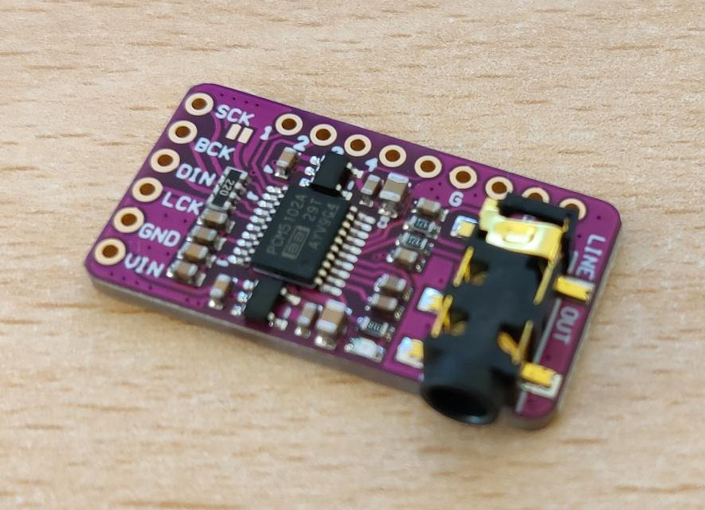
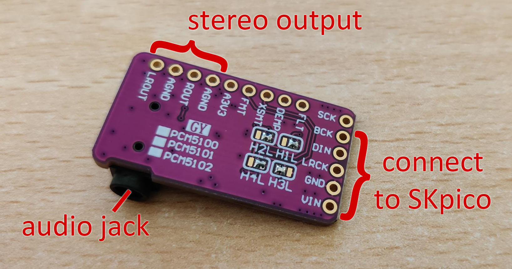

The PWM sound is output via the SID-socket. If you use the optional DAC-module you can directly get the stereo audio signal from the audio jack or connectors on the PCB. 

**Hint:** You can also connect the DAC-output to the video-audio-connector of the C64/C128. Pin 3 is the standard audio output, pin 7 is often used for the second audio channel. If you do so: use the firmware which *does not output via PWM*.

Note, which of the two output options is active depends on the firmware that you use (there are options for PWM-only and PWM+DAC simultaneously). PWM quality is slightly better when the DAC output is not enabled.

The order of pins to connect the DAC to the SKpico is easy to determine: the order is given once you match Vin which corresponds to Vcc at the SKpico and GND to GND.

#### PCB with onboard DAC 

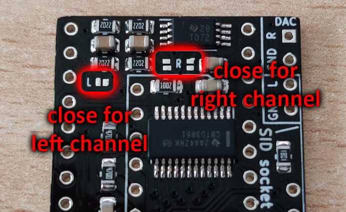

**Hint:** For best quality connect the DAC-output on the SKpico-PCB to the audio/video-socket (pin 3 and 7, sometimes 5 is used for the right channel) or to any other audio jack/socket.

To output the sound via the SID-socket you need to close solder jumpers! The one marked with "L" outputs the left channel through pin 27 of the SID-socket (the standard audio output). Note that this way, audio goes through the circuitry on the board and quality suffers a bit.
Optionally you can also close the two solder jumpers marked "R" to output the right channel to pin 26 (normally this pin is the "external in"!) -- this signal will be available on pin 5 on the audio/video socket, however, the circuitry dampens the signal significantly and this option only really makes sense on modified mainboards (e.g. connecting this pin to the video-socket).

**In short:** ideally connect the DAC-outputs directly to the audio/video-socket (then DO NOT close the solder jumpers), otherwise route the left channel through the mainboard by closing solderjumper "L".

 

### Powering the SKpico

The SKpico is powered from the C64/C128-mainboard, DO NOT power from USB.

 
  

## Firmware Uploading

The SKpico-PCBs do not need to be programmed in any way. Only the RPi Pico needs to be flashed with the pre-built binaries (available in the release package). 

The procedure is simple: press the 'Boot'-button on the RPi pico, connect to your PC and it shows up as USB-drive. Then simply copy the firmware (.uf2) to this drive.

**IMPORTANT:** DO NOT connect the RPi Pico to USB while it is plugged into your C64/C128! (but it's no problem if the Pico is soldered to the SKpico-PCB)

 

### Sidekick64-/RAD Expansion Unit-InterOp
If you're using [Sidekick64](https://github.com/frntc/Sidekick64) or [RAD Expansion Unit](https://github.com/frntc/RAD) then you should update to their latest firmwares.

 
  

## Configuration-Tool

The built-in configuration tool allows you to choose the emulated SID-types (or SID + FM), digi boost settings, volume and panning and is hopefully mostly self-explanatory.

The mouse/paddle-settings ("POT X/Y") deserve a bit of explanation: as one goal was to keep the interfacing circuitry simple, you might need to adjust some settings for the SKpico to work (best) with your mouse or paddles. Once you move the cursor to the potentiometer settings, a preview of the  values and movement is shown. You can now tune the configuration:
- if a mouse moves only horizontally or not at all then choose the "level" option (by pressing 'V'). This option does not work with paddles!
- if your mouse shows some more weird jumps, try the "outlier" option (key 'O'). There are two intensities: normal and aggressive outlier removal.
- the "trigger"-option (key 'T') implements an alternative reading of mouse values (pressing 'T' multiple times selects different voltage thresholds); note, trigger does sometimes not work on Pico clones -- read "troubleshooting" below on how to fix this.
- additional filters can reduce the inherent jittering of mice/paddles on the C64/C128 further: "median" is a simple yet good outlier rejection for remaining jitter. "smooth" uses a exponential weighted average (it comes in versions for paddles and mice).

**NOTE**: potentiometer filtering modes do not work with two paddles/mice used simultaneously.

If you choose 'reSID+digi detect' as emulation option, then the SKpico uses heuristics to detect modern digi playing techniques (such as that used in [Vicious Sid](https://codebase64.org/doku.php?id=base:vicious_sid_demo_routine_explained)) which yield improved quality compared to the (extended) reSID 0.16 emulation. These techniques, when detected successfully, are emulated with special code paths. The heuristics are  based on the findings by Jürgen Wothke used in [WebSid](https://bitbucket.org/wothke/websid/src/master/).

**To avoid bus conflicts** when you use cartridges operating in the IO1/2 address spaces, make sure you do not use the IO1/2 addresses for the SKpico as well. The configuration tool tries to detect cartridges and prints a warning message.

 

## Adding PRGs
 
You can add PRGs to the firmware which can then be started from the configuration tool (via F7) or directly from Basic with SYS 54333,0 (for the first PRG), SYS 54333,1 (2nd PRG) etc.

To add PRGs use *skpicopatch* (it's in the release package), with the respective firmware as parameter. This adds all PRGs listed in *prg.lst* to the firmware and writes it to *SKpicoPRG.uf2*.

 

## Troubleshooting

When the SKpico-hardware is build correctly you should be able to start the configuration tool from Basic. If this does not work reliably, first check the soldering. In case it still does not work properly, or you experience glitches with the mouse or paddles (more than the normal slight jittering) or very old SID-tunes (reading write-only registers...) your computer might be one of the rare machines requiring different-than-default timings. They can be modified by calling *skpicopatch* with two additional parameters. Their default values are 15 and 11, smaller values mean less waiting for reading/writing signals to the bus. Most likely you need to decrease these values if you experience problems with the default timings.

In case you use a **Pico-clone** with the RGB-LED (e.g. the black PCBs available from Chinese sellers) and it does not blink, make sure the solder jumper for the RGB-LED is closed (it sometimes isn't). 
If your mouse or paddles do not work properly, e.g. the x-paddle influences the y-paddle and vice versa, check the solder pad named "VREF": there should be a large resistor to fix the paddles, or close the solder pad with a blob such that the "trigger"-option also works.
In general, these PCBs seem to quite often have quality issues (bad soldering, even missing components), have a closer look at the PCBs if they behave strange.

 

## Firmware Building (if you want to):

The firmware has been built using the Raspberry Pi Pico SDK.

 
  
 
## Disclaimer

Be careful not to damage your RPi Pico, PC, or Commodore, or anything attached to it. I am not responsible if you or your hardware gets damaged. Note that the RPi Pico gets overclocked. If you don't know what you're doing, better don't... use everything at your own risk.

 
  
## License

My portions of the source code are work licensed under GPLv3 (except otherwise stated in a source file).

The PCBs are work licensed under a Creative Commons Attribution-NonCommercial-NoDerivs 4.0 (CC BY-NC-ND 4.0) International License. 

CC BY-NC-ND 4.0 also means: selling for profit on ebay (e.g. indicated by pricing), or running a shop and offering hardware under such license (no matter on which platform) is a violation of the license -- claiming 'service for the community', 'for those who can't solder themselves', or 'offer at cost price' to sell related services does not comply with the license. It is, of course, absolutely fine to order a small batch (e.g. 10 units) and sell surplus units to friends.

 

## License Hall of Shame

I have fun creating and improving the SKpico and my other projects. I'm happy when people share surplus boards at their own cost or make built SKpico available to others at low cost (I expect prices well below the official sellers). Unfortunately there are people seriously decreasing my fun factor by violating the CC BY-NC-ND 4.0-license for the hardware part, and this is the page section to which I come back when my mood has been spoiled: From now on I will list the license violations I'm aware of publicly (only public information, e.g. usernames will be used). 

Please welcome these sellers to the Hall of Shame:
<table>
<tr>
<td>  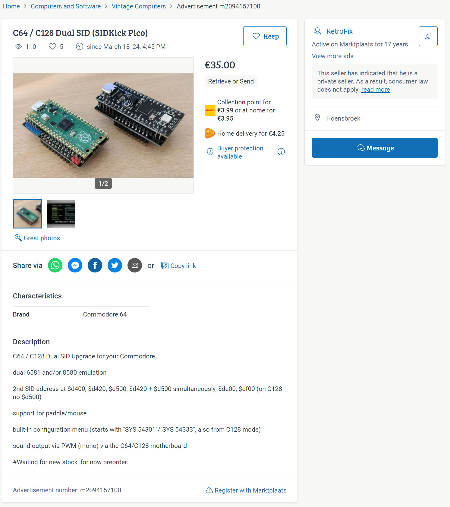  </td>
<td>35 Euros? Obviously no commercial intent at all...
</tr>
<tr>
<td>  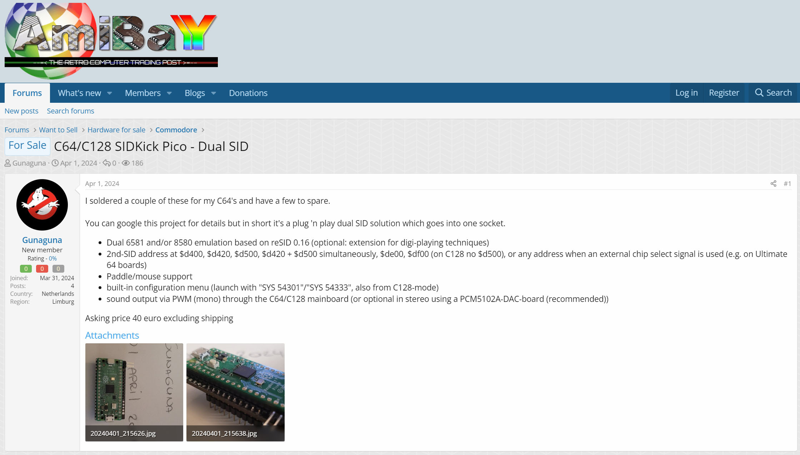  </td>
<td>40 Euros? Seriously?
</tr>
<tr>
<td>  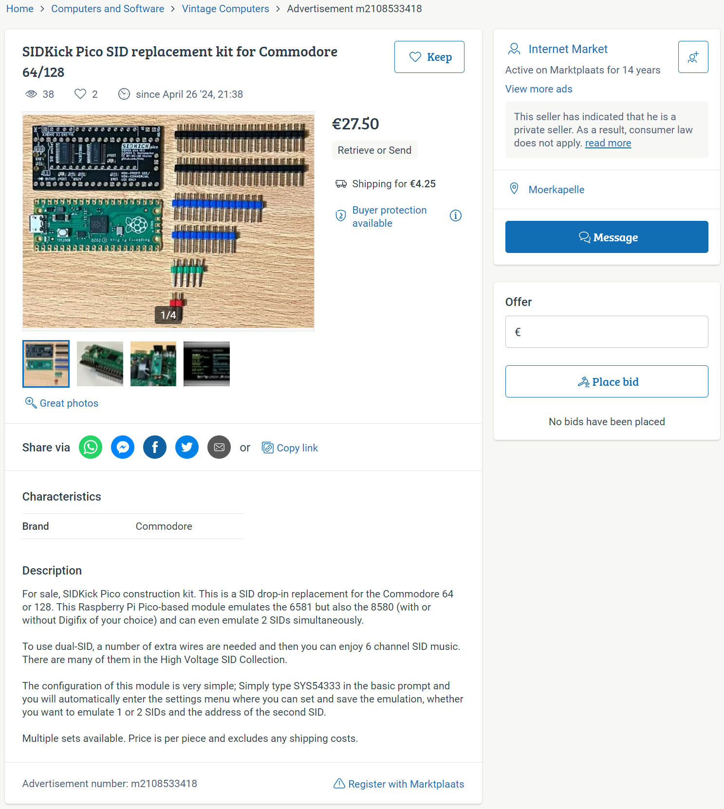  </td>
<td>27.50 Euros for a pre-assembled PCB kit with almost zero own work invested?
</tr>
<tr>
<td>  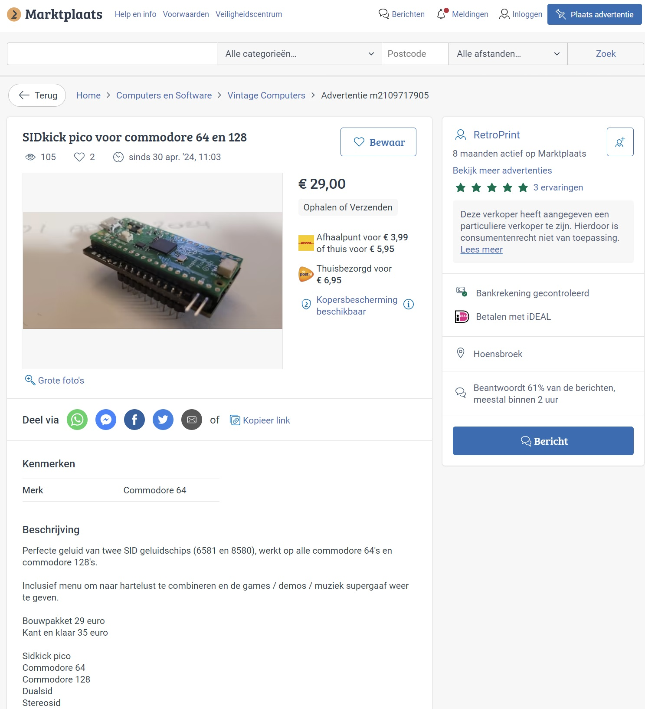  </td>
<td>Same seller as on Amibay and 1st entry (check out the photos)...
</tr>
</table>

 

## Acknowledgements

Last but not least I would like to thank a few people: Dag Lem for reSID, discussions and insights; Dan Tootill (and friends), emulaThor, bigby, TurboMicha, quadflyer8 and others on forum64.de for testing and feedback/bug reports; androSID for discussions and lots of information on electronics; [Retrofan](https://compidiaries.wordpress.com/) for designing the SIDKick-logo and his font which is used in the configuration tool; Flex/Artline Designs for letting me use his music in the config tool. Magnus Lind for releasing the Exo(de-)cruncher which is used in the firmware. Jürgen Wothke for releasing WebSid.

Thanks for reading until the very end. I'd be happy to hear from you if you decide to build your own SKpico!

## Trademarks

Raspberry Pi (Pico) is a trademark of Raspberry Pi Ltd.
